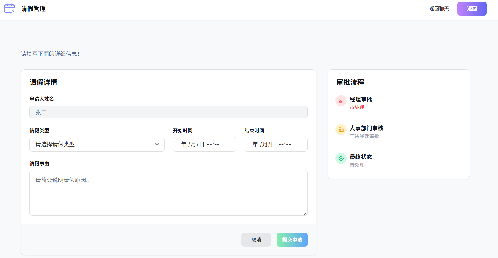

# 企业智能助手系统

一个企业智能助手系统，支持自然语言对话、意图识别和快捷业务办理。系统通过 AI 大模型识别用户意图后，直接跳转到对应的业务页面，简化操作流程。

## 项目背景

尽管现代办公自动化（OA）系统在提升效率和用户体验方面取得了显著进步，但仍然存在一些问题和挑战需要解决：

### 当前OA系统存在的问题

1. **智能化程度不足**
   - 许多OA系统尚未充分利用AI技术
   - 系统的智能化程度有限，无法充分理解和响应复杂的用户需求
   - 缺乏对自然语言的理解能力

2. **用户体验不佳**
   - 用户界面和交互设计不够友好
   - 用户在使用过程中感到困惑或不便
   - 操作流程复杂，需要多步骤操作

3. **系统集成和兼容性问题**
   - 不同的OA系统和工具之间缺乏良好的集成和兼容性
   - 导致信息孤岛和重复工作
   - 用户需要在多个系统间切换

4. **缺乏创新和灵活性**
   - 功能和设计上缺乏创新
   - 无法适应快速变化的工作环境和用户需求
   - 系统僵化，扩展性差

5. **学习曲线陡峭**
   - 复杂的OA系统需要用户花费大量时间学习
   - 对于技术水平较低的用户使用门槛高
   - 培训成本高
   - 




## 项目创新点

本项目充分利用大模型的强大能力，设计了一个既智能又高效的办公解决方案，旨在通过智能化的交互方式提升办公效率和用户体验。

### 核心创新

1. **AI驱动的自然语言交互**
   - 用户可以通过自然语言与系统进行沟通，无需记忆复杂的操作步骤
   - 系统能够理解"我想请假"、"查询张三的电话"等自然表达
   - 降低操作复杂性，使技术水平较低的用户也能轻松使用

2. **单智能体统一调度架构**
   - 采用单智能体设计，实现无缝的用户交互
   - 统一的意图识别和任务分发机制
   - 简化架构，提高系统响应速度和可靠性

3. **上下文感知的智能对话**
   - 系统能够实时分析用户输入，并根据上下文提供智能化的建议
   - 通过短期记忆和长期记忆机制，保持对话连贯性
   - 减少用户的思考负担，提高工作效率

4. **直接跳转的简化流程**
   - 识别到业务意图后，直接提供链接跳转到对应页面
   - 无需多轮对话收集信息，降低交互复杂度
   - 支持快捷指令（如`@请假`）和自然语言两种方式

5. **个性化服务能力**
   - 通过对用户历史交互的分析，提供个性化的服务
   - 满足不同用户的差异化需求
   - 支持上下文记忆，理解用户的业务习惯

6. **多模型兼容架构**
   - 支持多种大模型（DeepSeek、智谱AI、阿里通义、豆包等）
   - 可灵活切换和配置不同的AI模型
   - 降低对单一服务商的依赖

### 技术优势

- **零学习成本**：用户只需用自然语言表达需求，系统自动识别意图
- **高效响应**：简化架构减少中间环节，快速响应用户需求
- **易于扩展**：模块化设计，便于添加新的业务功能
- **智能化**：利用大模型的强大理解能力，提供智能化的服务体验

## 功能概览

### 核心功能

- **智能对话**：支持自然语言聊天，能够理解用户意图并给出相应回复
- **意图识别**：自动识别用户需求（请假、通讯录查询、出差、日程管理等）
- **快捷跳转**：识别到业务意图后，直接提供链接跳转到对应页面
- **上下文记忆**：支持短期对话历史和长期业务信息记忆


### 业务功能

1. **请假申请**（意图 1）
   - 自然语言表达："我想请假"、"明天请假"
   - 自动识别后跳转到请假申请页面 `/quick/leave`

2. **通讯录查询**（意图 2）
   - 自然语言表达："查询张三"、"找一下李华的电话"
   - 自动识别后跳转到通讯录查询页面 `/quick/contact`

3. **邮件发送**（意图 3）
   - 跳转到邮件发送页面 `/quick/email`

4. **出差申请**（意图 4）
   - 自然语言表达："我要出差"、"申请出差"
   - 自动识别后跳转到出差申请页面 `/quick/trip`

5. **日程管理**（意图 5）
   - 自然语言表达："查看日程"、"我的日程安排"
   - 自动识别后跳转到日程管理页面 `/quick/schedule`

## 系统架构

```
用户输入（自然语言或@快捷指令）
    ↓
意图识别（LLM）- 识别用户意图
    ↓
根据意图直接返回链接
    ↓
用户点击链接 → 跳转到对应业务页面
```

### 目录结构

```
work/
├── app.py                    # Flask 应用入口，路由定义
├── multi_agent.py            # 核心助手类，意图识别和分发
├── intent_service.py          # 意图识别服务封装
├── context_memory.py          # 上下文记忆管理（短期+长期）
├── memory.py                  # 兼容的短期记忆模块
├── llm.py                     # 多模型 LLM 调用封装（API Key 配置）
├── prompt_mangement.py        # 提示词模板管理
├── util.py                    # 数据库连接和工具函数
├── module/
│   └── calendar.py            # 日程模块
├── templates/                 # 前端模板
│   ├── index.html             # 主聊天界面
│   ├── contact.html           # 通讯录查询页面
│   ├── leaveForm.html         # 请假申请表单
│   ├── schedule.html          # 日程管理页面
│   ├── business_trip.html     # 出差申请页面
│   ├── quick_email.html       # 邮件发送页面
│   ├── person_info.html       # 个人详情页
│   └── department_info.html   # 部门详情页
├── static/                    # 静态资源
└── README.md                  # 本文档
```

## 运行环境

- **Python**: 3.9+
- **数据库**: MySQL 5.7+ / 8.0+（可选，用于通讯录和日程查询）
- **操作系统**: Windows / Linux / WSL

## 快速开始

### 1. 安装依赖

```bash
# 创建虚拟环境（推荐）
python -m venv venv

# 激活虚拟环境
# Windows:
venv\Scripts\activate
# Linux/WSL:
source venv/bin/activate

# 安装依赖
pip install flask pymysql requests openai zhipuai
```

### 2. 配置 API Key

编辑 `llm.py` 文件，配置您的大模型 API Key：

```python
# work/llm.py 第 13-14 行（DeepSeek，当前默认使用）
deepseek_client = OpenAI(api_key="你的DeepSeek_API_Key",
                base_url="https://api.deepseek.com")

# 其他可选模型：
# - 智谱AI（第 6 行）
# - 阿里通义千问（第 8-10 行）
# - 豆包（第 16-20 行）
```

**获取 API Key**：
- DeepSeek: https://platform.deepseek.com/
- 智谱AI: https://open.bigmodel.cn/
- 阿里通义: https://dashscope.aliyuncs.com/

### 3. 配置数据库（可选）

如果使用通讯录查询或日程管理功能，需要配置数据库。

编辑 `util.py` 文件中的 `db_config`：

```python
db_config = {
    'host': 'localhost',
    'user': 'root',
    'password': '123456',
    'database': 'world',
    'charset': 'utf8mb4'
}
```

创建数据库和表（参考下方数据库结构）。

### 4. 启动服务

```bash
python app.py
```

浏览器访问：`http://127.0.0.1:5000/`

## 主要接口

### 聊天相关

- `GET /` - 主聊天界面
- `POST /send_message` - 发送消息，返回 AI 回复和链接

### 快捷入口

- `GET /quick/leave` - 请假申请页面
- `GET /quick/contact` - 通讯录查询页面
- `GET /quick/email` - 邮件发送页面
- `GET /quick/trip` - 出差申请页面
- `GET /quick/schedule` - 日程管理页面

### 业务提交

- `POST /submit_leave` - 提交请假申请
- `POST /submit_business_trip` - 提交出差申请

### 数据查询

- `GET /get_user_info` - 获取当前用户信息
- `GET /get_weather_data` - 获取天气数据（按月缓存）

## 系统特性

### 简化架构

- **直接跳转模式**：识别到意图后直接返回链接，无需多轮对话
- **统一处理流程**：所有输入（自然语言或 @快捷指令）都走统一的意图识别流程
- **上下文感知**：保留对话历史，支持上下文理解

### 意图识别

系统支持的意图类型：
- `0`: 闲聊对话
- `1`: 请假申请
- `2`: 通讯录查询
- `3`: 邮件发送
- `4`: 出差申请
- `5`: 日程管理

### 快捷指令

支持以下快捷指令（与自然语言等价）：
- `@请假` / `@leave` - 请假申请
- `@通讯录查询` / `@contact` - 通讯录查询
- `@邮箱` / `@email` - 邮件发送
- `@出差` / `@trip` - 出差申请
- `@日程` / `@schedule` - 日程管理

## 应用场景

- 企业内部办公助手：员工日常办公的智能入口

- 研究和演示项目：展示AI在OA系统中的落地方式

- 学术研究项目：探索大模型在办公自动化中的应用


